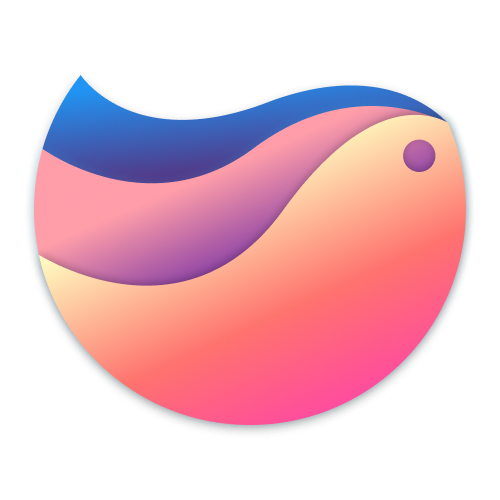
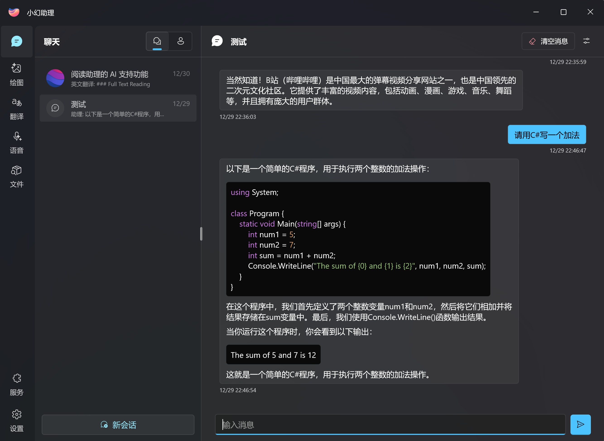

# 小幻助理

    

人与AI相互成就的一次探索

---

**小幻助理** 集成了 Open AI 和 Azure 的 AI 服务，致力于构建以大语言模型为核心，具备高延展性的个人助理工具。

## 🙌 简单的开始

### 从商店安装

  <a title="从 Microsoft 获取" href="https://www.microsoft.com/store/apps/9NB0NB3MLQTM?launch=true&mode=full" target="_blank">
    <picture>
      <source srcset="https://get.microsoft.com/images/zh-CN%20light.svg" media="(prefers-color-scheme: dark)" />
      <source srcset="https://get.microsoft.com/images/zh-CN%20dark.svg" media="(prefers-color-scheme: light), (prefers-color-scheme: no-preference)" />
      
    </picture>
  </a>

### 运行环境要求

|          |                             |
| -------- | --------------------------- |
| 系统版本 | Windows 10 ver 19041 及以上 |
| 运行时   | .NET 8                      |

### 服务配置

应用不提供初始的密钥配置，这要求你拥有一些自己的服务及其密钥，这是对应关系：

| 服务                     | 涉及功能                                     |
| ------------------------ | -------------------------------------------- |
| Open AI / Azure Open AI / 私有模型 | 对话、助理管理、会话管理 |
| DALL·E3         | 文生图                                       |
| Azure Speech Service     | 文本转语音、语音识别                         |
| Azure Translator / 百度翻译       | 文本翻译                                     |
| Everything               | 文件搜索                                     |

### 扩展服务

TBD

## ❓ 常见问题

在应用的安装使用过程中，你可能会碰到一些问题，这篇文档也许可以帮助你解决遇到的困难：[常见问题](https://github.com/Richasy/RichasyAssistant/wiki/)

## 📃 文档

所有关于 **小幻助理** 的文档，包括架构、使用说明等，都放在仓库的 [Wiki](https://github.com/Richasy/RichasyAssistant/wiki) 中，如果你发现有文档缺失或错误，请提交 [Issue](https://github.com/Richasy/RichasyAssistant/issues/new/choose) 说明错漏的内容。

## 🔒 数据安全

1. 代码全部开源，首选引用开源依赖，开发者承诺不会在上传应用商店的版本中添加额外代码。
2. 不上传隐私数据和日志记录，所有日志保留在本地，未来会视情况进行有限度的应用使用情况数据收集。

同时，你也需要注意自身的数据安全，尽量避免使用未知来源或闭源的扩展服务，避免将涉密信息、敏感内容、商业机密等数据直接发送给相关服务商。

## 🚀 协作

我们欢迎志同道合的朋友参与 **小幻助理** 项目，在这里分享你的见解与思路。
你可以选择以下内容参与：

| 方向             | 价值                                                           |
| ---------------- | -------------------------------------------------------------- |
| 应用主体程序开发 | 为用户提供稳定可靠的服务基底                                   |
| 核心库开发       | 为用户或其它插件开发者提供足够通用和基础的工具                 |
| 扩展服务开发        | 支持越来越多的开源模型 |
| 经验分享         | 我们诚挚邀请你向其他用户分享你的使用经验，提出你对应用新的期许 |
| 更多             | 我们欢迎任何形式的贡献                                         |

## 🤩 感谢

- [Windows App SDK](https://github.com/microsoft/WindowsAppSDK)
- [Semantic Kernel](https://github.com/microsoft/semantic-kernel)
- [Community Toolkit](https://github.com/CommunityToolkit)
- [azure-sdk-for-net](https://github.com/Azure/azure-sdk-for-net)
- [NLog](https://nlog-project.org/)
- [H.NotifyIcon](https://github.com/HavenDV/H.NotifyIcon)
- [CsvHelper](https://github.com/JoshClose/CsvHelper)
- [EverythingNet](https://github.com/ju2pom/EverythingNet)
- [Markdig](https://github.com/xoofx/markdig)
- 以及其他开源贡献者.

## 交流

你可以加入 QQ 群进行交流

## 🧩 截图

